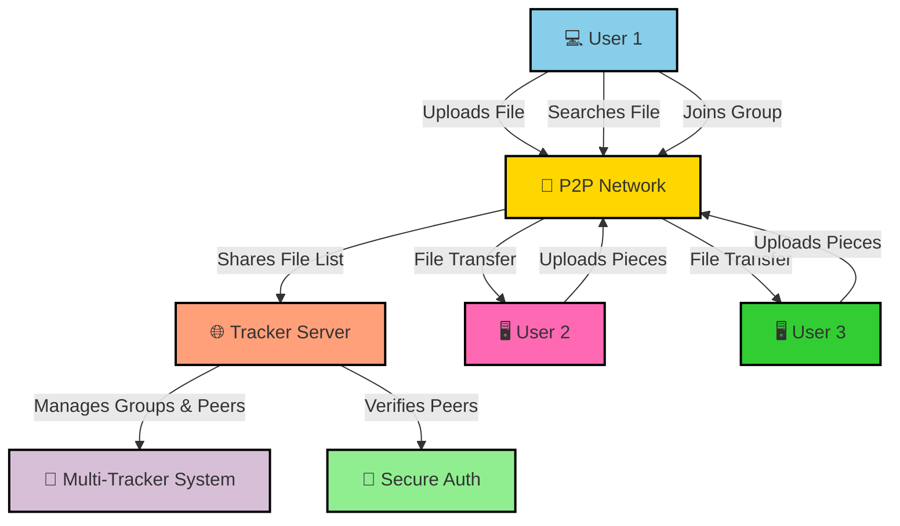
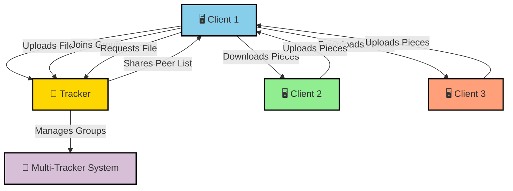

# 📂 Distributed Peer-to-Peer File Sharing System

*A high-performance, fault-tolerant peer-to-peer file sharing system enabling secure and efficient file distribution.*


---

## 📌 Table of Contents

- [Introduction](#introduction)
- [System Overview](#system-overview)
- [Architecture Diagram](#architecture-diagram)
- [Commands](#commands)
- [How to Run](#how-to-run)
- [Features](#features)
- [Contributing](#contributing)
- [License](#license)

---

## **📌 Introduction**
The **Distributed Peer-to-Peer File Sharing System** allows users to share, download, and manage files efficiently within decentralized groups.  
This system is designed to be **fault-tolerant, scalable, and efficient**, leveraging **multi-tracker redundancy** and **parallel file transfers**.

---

## **📌 System Overview**
The system consists of two main components:

### **1️⃣ Tracker (Central Coordination)**
- Acts as a **central directory** that manages group information and tracks shared files.
- Facilitates **user authentication, group creation, and file registration**.
- **Multiple trackers** can be deployed for redundancy.

### **2️⃣ Client (User Node)**
- Users **interact with the system** via a CLI-based client.
- Clients can **upload, download, and share files within groups**.
- Implements **piece selection algorithms** for faster, distributed file downloads.

---

## **📌 Architecture Diagram**
The **flow of operations** within the **P2P File Sharing System** is illustrated below:


## **📌 Commands**
The system provides a command-line interface (CLI) with the following operations:
### 🔹 User Management
```
create_user <user_id> <passwd>
login <user_id> <passwd>
logout
```

### 🔹 Group Operations
```
create_group <group_id>
join_group <group_id>
leave_group <group_id>
list_groups
list_requests <group_id>
accept_request <group_id> <user_id>
```
### 🔹 File Operations
```
upload_file <file_path> <group_id>
list_files <group_id>
download_file <group_id> <file_name> <destination_path>
```
## 📌 How to Run
### 1️⃣ Start the Tracker
```
./tracker tracker_info.txt tracker_no
The file tracker_info.txt contains IP and port details of all trackers.
To close the tracker: quit
```
### 2️⃣ Start a Client
```
./client <IP>:<PORT> tracker_info.txt
```
The tracker_info.txt should contain IP and port details of all available trackers.

### 3️⃣ Execute Client Commands
Once the client is running, you can execute any supported command to interact with the system.

## 📌 Features
🌍 Decentralized File Sharing → Clients communicate directly without central dependency.
⚡ Parallel Downloading → File pieces are retrieved from multiple peers simultaneously for efficiency.
🔀 Multi-Tracker System → Multiple trackers ensure redundancy and prevent single points of failure.
📜 Intelligent Piece Selection → Ensures optimal downloading strategy.
🛡️ Secure & Private Groups → Users can create and manage groups, restricting file access to members only.

## 📌 Contributing
We welcome contributions to improve this system!
Feel free to submit issues, feature requests, or pull requests to help enhance the project.

🔹 Fork this repository
🔹 Create a feature branch
🔹 Commit changes & submit a pull request

## 📜 License
This project is licensed under the MIT License.
See LICENSE for details.

---

## 📩 Contact
For any questions or contributions, feel free to connect:

- Email: suyashkhareji@gmail.com
- LinkedIn: linkedin.com/in/suyash
- GitHub: github.com/Suyash9698

---
